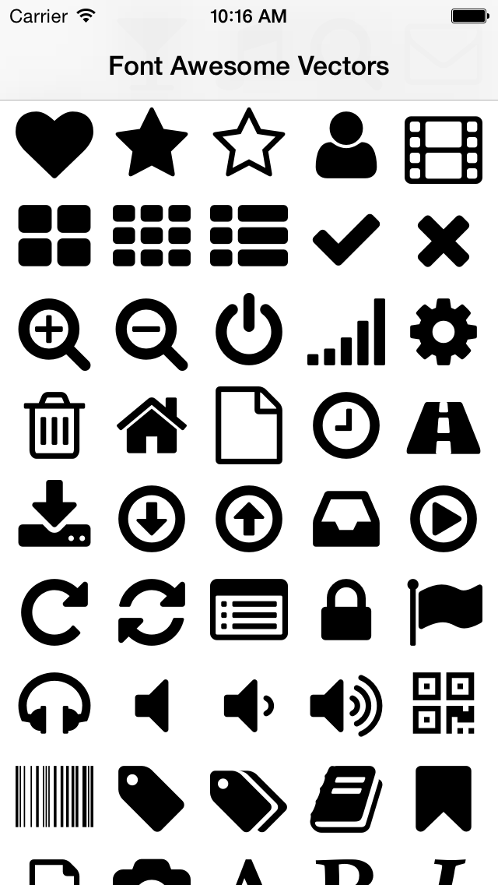

# FOAVectors

FOAVectors is an easy way to render Font Awesome vectors on iOS. It uses a copy of the Font Awesome SVG font to render these vectors, as well as a UIBezierPath extension to process the path data.

## Usage

To run the example project, clone the repo, and run `pod install` from the Example directory first.

## Requirements

iOS 7+.

## Installation

FOAVectors is available through [CocoaPods](http://cocoapods.org). To install
it, simply add the following line to your Podfile:

    pod "FOAVectors"

## Author

Programming Thomas, programmingthomas@gmail.com

## License

FOAVectors is available under the MIT license. See the LICENSE file for more info.

